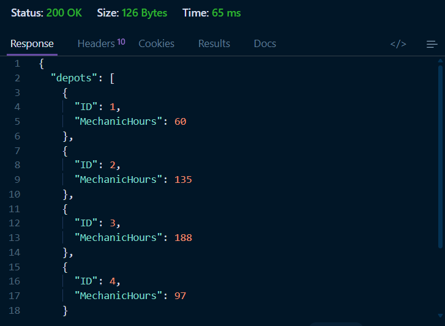
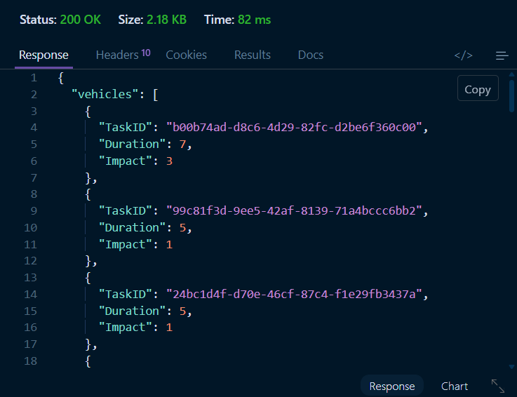

# Vehicle Maintenance Scheduler

Simple Node.js microservice for selecting vehicle maintenance tasks using the 0/1 knapsack algorithm.

## Setup

```bash
cd vehicle_maintenance_scheduler
npm install
npm start
```

## Environment

The default evaluation service base URL is `http://20.207.122.201`.

Set your authorization token before starting the server:

```powershell
$env:EVALUATION_SERVICE_TOKEN="your_token_here"
npm start
```

If the evaluation service URL changes, set `EVALUATION_SERVICE_BASE_URL` too:

```powershell
$env:EVALUATION_SERVICE_BASE_URL="http://20.207.122.201"
$env:EVALUATION_SERVICE_TOKEN="your_token_here"
npm start
```

## Endpoint

```http
GET /optimize/:depotId
```

Example response:

```json
{
  "depotId": "D1",
  "selectedTasks": [],
  "totalImpact": 0,
  "totalDuration": 0
}
```

## API Screenshots

### Depots API Response



### Vehicles API Response


